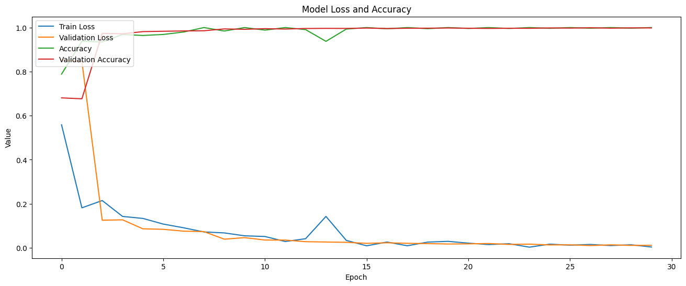

# Real-Time Finger Counting AI

**Author:** Eytan Weill  
**Course:** 420-SNT-MS Object-Oriented Programming (Fall 2025)  
**Instructor:** Robert D. Vincent

## About This Project
This project explores computer vision and deep learning to solve the problem of counting fingers in real-time using a webcam feed. By leveraging OpenCV for image processing and TensorFlow/Keras for image classification, the application detects a hand within a specific region of interest (ROI), processes the visual data, and uses a Convolutional Neural Network (CNN) to predict the number of fingers held up (0-5).

This project demonstrates the integration of:
* **Object-Oriented Programming:** Modular design using classes.
* **Computer Vision:** Background subtraction and contour detection.
* **Deep Learning:** Training and deployment of a CNN.
* **Matrix Based Masking** Masking an image with vector math and matrices. 
* **Open-CV** Image manipulation in realtime as well as implementation of webcam.


## Installation & Requirements

To run this project, you must have Python 3 installed.

### Dependencies
The project relies on several external libraries. You can install them using the provided `requirements.txt` file:

```bash
pip install -r requirements.txt
```

Imported dependencies include: 
- **OpenCV:** For image manipulation and implementing the webcam feed and ROI of the mask. 

- **Tensorflow:** AI framework used to train the AI model.

- **Keras:** Wrapper for the formatting and organization of the data for the training process, as well as the creation and loading of the actual model.

- **Matplotlib:** Used to view data organization and histogram of the training process. 

- **Numpy:** Containement of images as arrays and matrices. Also used for manipulation of image data.  

- **Glob:** Loading in of the dataset. 

> **Note:** If you have an Nvidia graphics card and want to test wether or not Cuda (the Nvidia framework for training AI models with code) works, then you can go into the PyTorch website, install the right cuda version for your operating system and run:
```bash
python test.py
```

## How to use

### Training 
If you want to train a model yourself and make some minor tweaks to the actual training, you can do that through the ```training.ipynb``` file.

But before that, you would need to get a dataset. I used Kaggle's "finger" dataset[[2](#References)] to train my model. In the ```train.ipynb``` file, just be sure to have your training data and testing data sgemented into the right folders and fix the formatting of your dataset to your desired resolution. 

> **NOTE:** Some of the libraries do not play nice with online notebooks, so if you plan on using a service like Google Colab or Databricks, there might be so tweaks needed to get the training to work. 

### Utilization

After installing all the dependencies, running the program with the pretrained file is as easy as having a webcam already connected to your device and running the command:
```bash
python model.py
```

This operation will use the already existing pretrained model, ```realtime_fingers_detection.keras```. 

You would need to change the model path: 

```python
MODEL_PATH_REL = './realtime_fingers_detection.keras'
```

to the path of any other model that you would like to use.

The actual running of the file uses a mask that it applies to the webcam feed to isolate your hand. It does this by saving the intial static background without you hand in it, and then will use that saved background to substract it to any changes in the webcam feed. This will isolate the only new components in the image, being your hand. 

> **Note:** This only works if you background is static. Meaning that your webcam must not move at all when ```model.py``` is running. If your webcam does accidently move, simply press the `r` key on your keyboard to recalibrate the masking. 

When you want to exit the program, simply press the `ESC` to exit the program. 


https://github.com/user-attachments/assets/6a04c0b1-7c2b-4aeb-ae67-1eadeb84e8f6


### Pretained Model

In the repository, you will see a file called ```realtime_fingers_detection.keras```. This is the model that is used by default in the ```model.py``` file. It was trained for 30 Epochs and is set to be about 99.97% accurate in its predictions.



## References
1. [Medium article](https://medium.com/@guptakgk14/creating-a-custom-cnn-for-real-time-finger-detection-947222db71b0) for training by Gaurang Gupta
2. [Kaggle Fingers Dataset](https://www.kaggle.com/datasets/koryakinp/fingers) 


